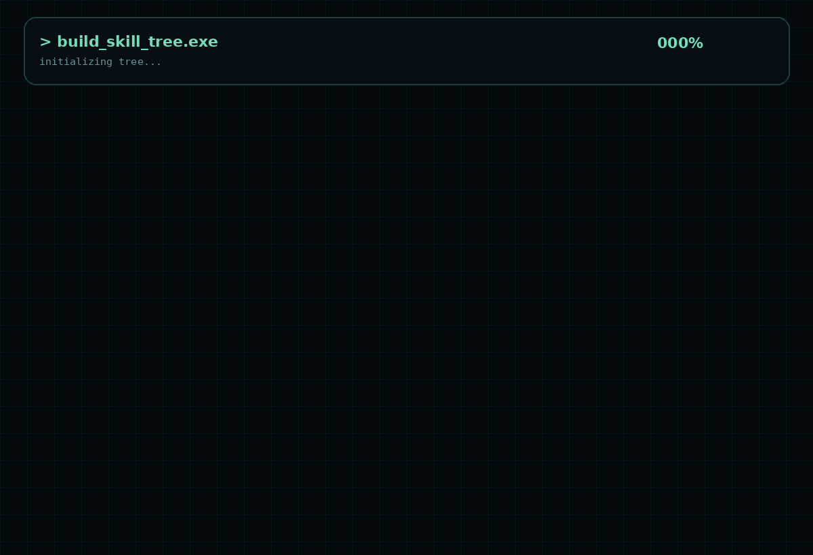

<h1 align="center">⚡ 𝙳𝙸𝚅𝚈𝙰𝙽𝚂𝙷 𝙶𝚄𝙿𝚃𝙰</h1>

<h3 align="center">
  ✦ 𝐂𝐒𝐄 @ 𝐒𝐋𝐈𝐄𝐓 &nbsp;•&nbsp; 𝐁𝐚𝐜𝐤𝐞𝐧𝐝 &nbsp;•&nbsp;
</h3>

  

  

 

  

  🎓 &nbsp; <b>𝟗.𝟗𝟕 / 𝟏𝟎</b> &nbsp;•&nbsp; <i>CGPA · CSE</i>
    
  🎬 &nbsp; <b>𝟕𝟎+</b> &nbsp;•&nbsp; <i>Educational Videos Created & Edited</i>

Currently learning → Backend Development • Machine Learning • AI Engineering

